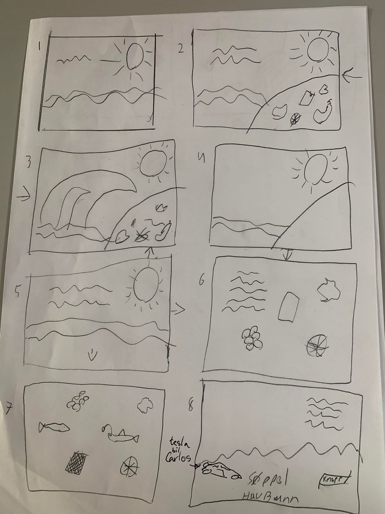
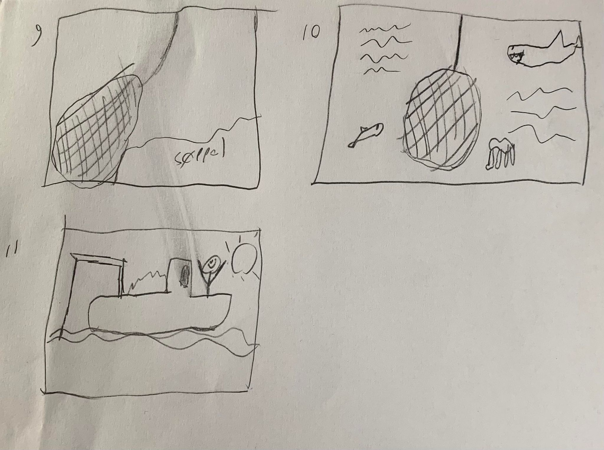

# Oblig 3: Goal 14 - Life below water
### Project overview and purpose
This projects is built on the sustainability goal 14: Life below water. Especially focusing on beach pollution beeing brought into the sea.
The purpose of this project is to spread awareness of what happens below water due to our pollution, and what you can do to help. 

### Brainstorming
During the brainstorming we discussed the different goals we found interesting, and decided to focus on goal 14 - Life below water.
For goal 14 we had a few different ideas. We discussed overfishing, co2 pollution and plastic pollution/pollution from beaches. We landed on making a scrollytelling about pollution from a beach.
We agreed on a story where we follow the pollution from the beach to the bottom of the sea. Then we started to create the storyboard for the scrollytelling.

### Storyboard
The storyboard attached below shows how we mainly wanted our scrollytelling to look. The story starts with a scene from the sea, and scrolls to a beach full with trash. A big wave comes and swallows the trash from the beach. Then the story scrolls down, with the trash the wave collected. Fish and different sea animals appears in this scene. Then the trash reaches the bottom, and lands beside the Tesla. A button can be clicked, that makes a net pick up the trash from the bottom of the sea. We follow the net up to the sea's surface.
###### Image 1/2:

###### Image 2/2:

### Github page link
- LINK

### Technology stack: animations, interactions and observers implemented
#### Animations:
###### For the waves:
- wavearrive - ease-in-out
- rotatewave - infinite
- movewave - linear infinite
##### For the boat:
- rocking-boat - infinite
###### For the clouds:
- moveCloud1 - linear infinite
- moveCloud2 - linear infinite
- moveCloud3 - linear infinite
###### For the h1 (scene 1)
- opacityoff
###### For the fishes, jellyfish, turtle and crab:
- swim1 - linear infinite
- swim2 - linear infinite
- swim3 - linear infinite
- swim4 - linear infinite
- bounce - infinite
- bounce2 - ease infinite
###### Specific for the turtle:
- rotate - linear infinite

#### Interactions: 
- 
#### Observers:
- .container - .panel, Creating a horizontal scroll effect during the first scene
- .beach - big-wave, Adding classes and changing img=src on intersection
- -scene5 - scene5__text, making text visible after some time when scrolling to scene .

